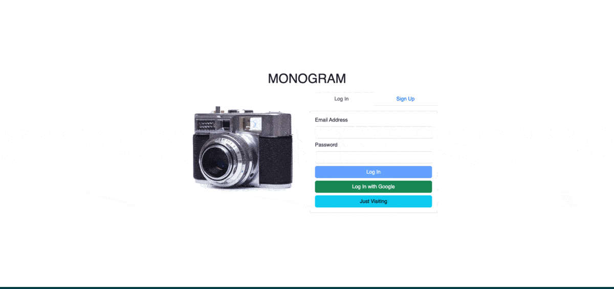

# Monogram - An Instagram Clone
An Instagram clone incorporated weather widget to monitor weather/light condition  
[Live Demo](https://lemuellin.github.io/monogram/) :point_left:



# Features
-	Integrated Firebase Firestore and Cloud Storage for individual post information
-	Implemented Google and email authentication through Firebase to handle user login securely
-   Asynchronously fetches and extracts current weather data from Open Weather API
-   Interpreted and mediated JSON data from API into user-readable data
-	Mobile Responsive

# Technologies
-	React
-	Firebase Firestore
-	Firebase Authentication
-	Firebase Storage
-	React Router
-	Bootstrap
-   REST API
-   aync/await JS

## Getting Started
##### Install and Run
```
git clone https://git@github.com:lemuellin/monogram.git
cd monogram
npm install
npm start
```